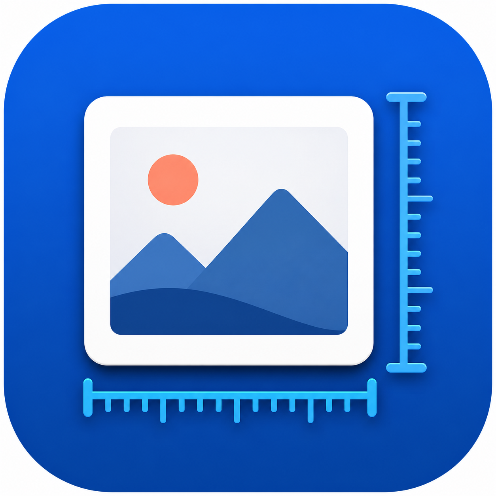
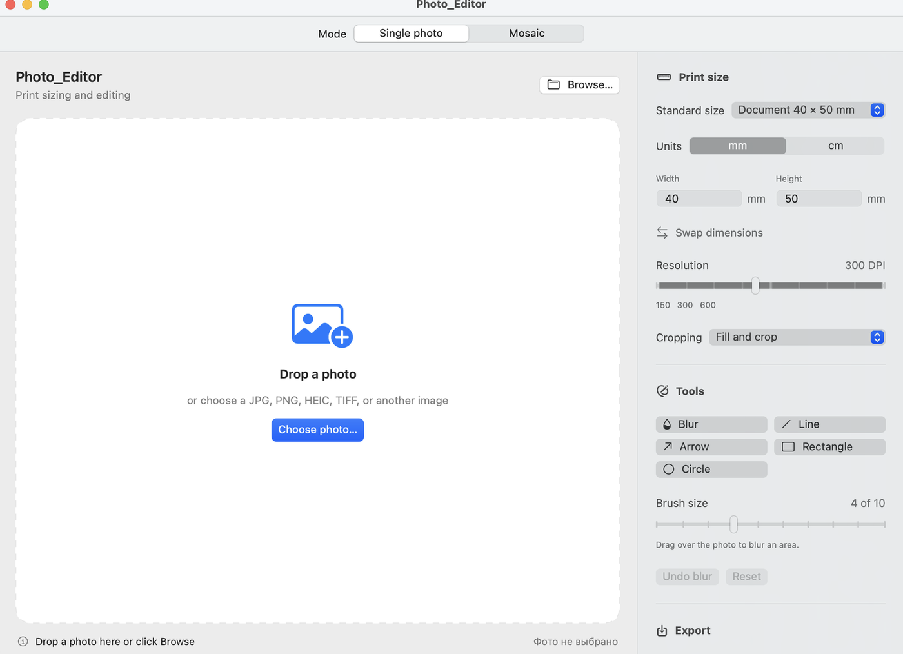
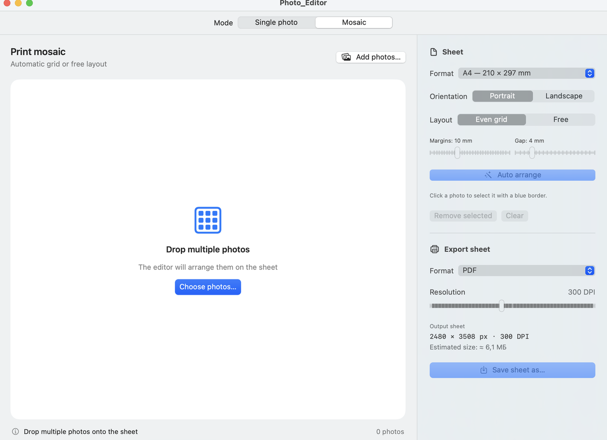
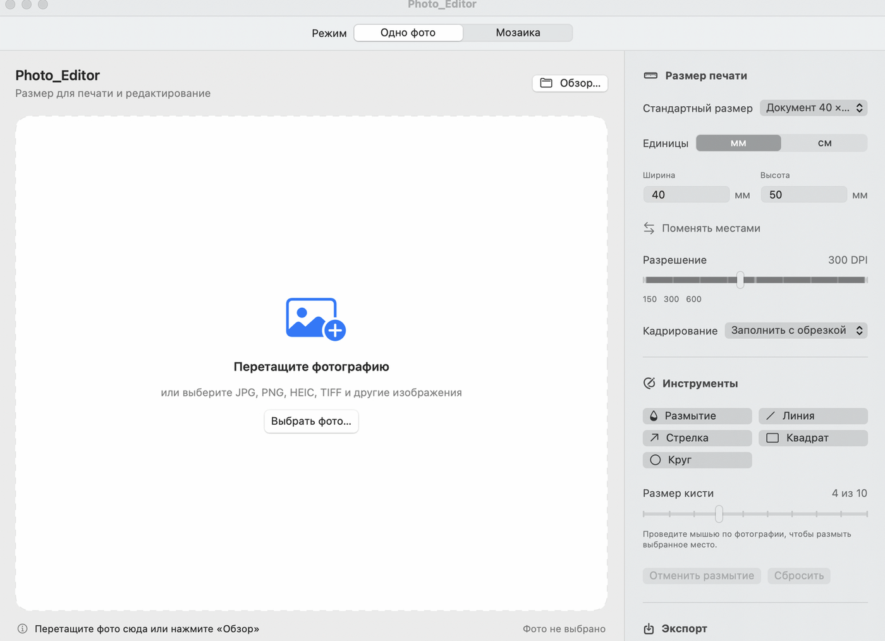
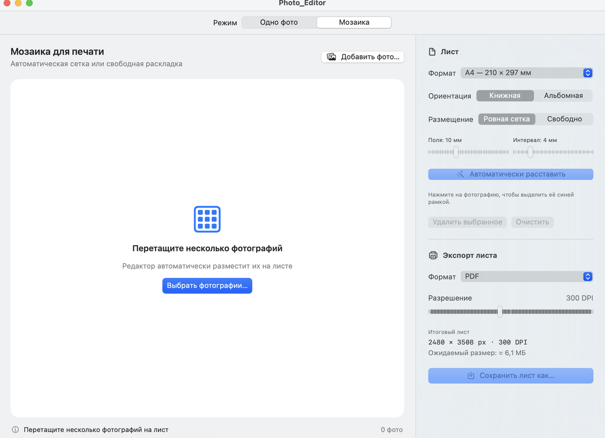

<p align="center">
  
</p>

<h1 align="center">Photo_Editor</h1>

<p align="center">
  A native print-oriented photo editor for Apple Silicon Macs.<br>
  Нативный фоторедактор для подготовки фотографий к печати на Mac с Apple Silicon.
</p>

<p align="center">
  
  
  
  
</p>

<p align="center">
  <a href="#english">English</a> · <a href="#русский">Русский</a> ·
  <a href="https://github.com/Coloded/photo_editor/releases/latest/download/Photo_Editor-stable.dmg">Download stable DMG / Скачать stable DMG</a>
</p>

---

# English

Photo_Editor is a lightweight native macOS app for resizing photos to exact print dimensions, annotating images, and creating printable photo mosaics. Processing is performed locally on the Mac; photos are not uploaded to external services.

## Download and installation

1. Download the [latest stable Photo_Editor DMG for Apple Silicon](https://github.com/Coloded/photo_editor/releases/latest/download/Photo_Editor-stable.dmg).
2. Open the DMG image.
3. Drag `Photo_Editor.app` onto the **Applications** shortcut.
4. On the first launch, right-click the app and choose **Open** if macOS displays an unidentified-developer warning.

> Photo_Editor is currently ad-hoc signed and is not notarized through the Apple Developer Program.

## Requirements

- macOS 13 Ventura or later.
- Apple Silicon: M1, M2, M3, M4, or newer.
- The app is ARM64-only and does not run through Rosetta.

## Single photo mode

- Drag and drop from Finder or Apple Photos.
- Paste an image from the clipboard with **Command–V** or **Edit → Paste**.
- Open JPG, PNG, HEIC, TIFF, BMP, GIF, and other formats supported by ImageIO.
- Enter exact print size in millimeters or centimeters.
- Use standard document, photo, and ISO paper presets.
- Select resolution from 72 to 600 DPI.
- Fill-and-crop or fit-with-margins modes.
- Local blur brush with size levels 1–10.
- Vector-style lines, arrows, rectangles, and circles.
- Line width levels 1–10 and the native macOS color picker.
- Live output pixel dimensions and estimated file size.
- Export to JPG, PNG, HEIC, or TIFF with DPI metadata.

## Mosaic mode

- Import multiple photos at once, including drag and drop from Apple Photos.
- Paste one or several clipboard images with **Command–V**.
- A0–A6 paper sizes with portrait and landscape orientations.
- Even grid and free-layout modes.
- Automatic arrangement without cropping the original images.
- Adjustable page margins and gaps.
- Select every image on the sheet from the canvas or thumbnail strip.
- Move and resize photos proportionally.
- Optional snapping to neighboring photos and sheet edges.
- When snapping is enabled, a resized photo can push overlapping neighbors.
- Export print-ready sheets to PDF, JPG, or PNG.

## Screenshots

| Single photo | Mosaic |
|---|---|
|  |  |

## Languages

The interface supports Russian and English. Use **Language / Язык** in the macOS menu bar. The selected language is stored in `UserDefaults` and restored on the next launch. On the first launch, the app follows the preferred macOS language.

## Updates

- Use **Photo_Editor → Check for Updates…** or the button in **About Photo_Editor**.
- Automatic stable update checks can be enabled or disabled in the About window.
- Updates are downloaded from GitHub Releases and installed into `/Applications` by Sparkle 2.9.2.
- The DMG archive and appcast feed are verified with EdDSA signatures before installation.
- The permanent stable download URL is `releases/latest/download/Photo_Editor-stable.dmg`.
- Update controls are translated into Russian and English and follow the saved application language.

## Native Apple technologies

- **SwiftUI** — native macOS interface.
- **Metal + Core Image** — GPU-accelerated image processing and blur.
- **ImageIO** — decoding, encoding, format support, and DPI metadata.
- **Core Graphics** — high-quality resizing, annotations, and sheet composition.
- **PDF** — print-ready mosaic export.
- **Uniform Type Identifiers / NSItemProvider** — Finder and Apple Photos drag and drop.
- **UserDefaults** — persistent language preference.
- **Sparkle 2.9.2** — signed, in-app application updates.

## Build from source

The repository uses Swift Package Manager and Apple Command Line Tools. The build script performs a preflight check, finds a compatible macOS SDK, validates the ARM64 executable and ad-hoc signature, and reports missing components with installation instructions. If Command Line Tools are missing, an interactive run offers to open Apple's system installer.

```bash
git clone git@github.com:Coloded/photo_editor.git
cd photo_editor
./scripts/build-app.sh
```

The release app is created at `dist/Photo_Editor.app`. Every successful build also creates and verifies `Releases/Photo_Editor-1.4.2-macOS-arm64.dmg` with an Applications shortcut. A normal interactive build asks for confirmation and then installs the app into `/Applications`.

Optional commands:

```bash
# Build a DMG and additionally create a ZIP archive
./scripts/build-app.sh --archive

# Build the app and DMG without installing (used by CI)
./scripts/build-app.sh --no-install

# Install without an additional confirmation prompt
./scripts/build-app.sh --yes

# Show all options
./scripts/build-app.sh --help
```

The script never installs developer components silently. When a required Apple component cannot be installed automatically, it names the missing component and explains what the user needs to install.

GitHub Actions runs the same script on every update to `main` and uploads the verified DMG as a workflow artifact. For version tags, the workflow also creates a GitHub Release and attaches the DMG.

Before publishing a stable version, update the bilingual `updates/release-notes.md`, build the app, and create signed stable assets using the EdDSA private key stored in the local macOS Keychain:

```bash
./scripts/build-app.sh --no-install
./scripts/prepare-update.sh
```

The private update key never enters the repository or GitHub Actions. The tagged workflow publishes the already signed `Photo_Editor-stable.dmg` and `appcast.xml`.

## Privacy

Photo_Editor works locally and does not contain analytics, advertising, user accounts, or photo-upload features.

---

# Русский

Photo_Editor — лёгкое нативное приложение для macOS, предназначенное для изменения фотографий под точные размеры печати, добавления разметки и создания печатных фотомозаик. Вся обработка выполняется локально на Mac; фотографии не загружаются во внешние сервисы.

## Скачивание и установка

1. Скачайте [последний стабильный DMG Photo_Editor для Apple Silicon](https://github.com/Coloded/photo_editor/releases/latest/download/Photo_Editor-stable.dmg).
2. Откройте образ DMG.
3. Перетащите `Photo_Editor.app` на ярлык **Applications** («Программы»).
4. При первом запуске нажмите на приложение правой кнопкой мыши и выберите **Открыть**, если macOS покажет предупреждение о неизвестном разработчике.

> Сейчас приложение имеет локальную ad-hoc подпись и не проходило нотариальное заверение Apple Developer Program.

## Системные требования

- macOS 13 Ventura или новее.
- Apple Silicon: M1, M2, M3, M4 или более новый процессор.
- Приложение собирается только для ARM64 и не использует Rosetta.

## Режим «Одно фото»

- Перетаскивание изображений из Finder и приложения Apple «Фото».
- Вставка изображения из буфера обмена через **Command–V** или **Правка → Вставить**.
- Открытие JPG, PNG, HEIC, TIFF, BMP, GIF и других форматов ImageIO.
- Точные размеры печати в миллиметрах и сантиметрах.
- Стандартные размеры документов, фотографий и листов ISO.
- Разрешение от 72 до 600 DPI.
- Заполнение с обрезкой или вписывание с полями.
- Локальная кисть размытия размером 1–10.
- Линии, стрелки, прямоугольники и круги.
- Толщина линии 1–10 и системный выбор цвета macOS.
- Расчёт итогового разрешения и ожидаемого размера файла.
- Экспорт в JPG, PNG, HEIC или TIFF с сохранением DPI.

## Режим «Мозаика»

- Загрузка сразу нескольких фотографий, включая drag-and-drop из Apple «Фото».
- Вставка одной или нескольких фотографий из буфера обмена через **Command–V**.
- Форматы листов A0–A6, книжная и альбомная ориентации.
- Ровная сетка и свободная раскладка.
- Автоматическая расстановка без обрезки исходных фотографий.
- Настраиваемые поля и интервалы.
- Выбор каждого снимка на листе или через ленту миниатюр.
- Свободное перемещение и пропорциональное масштабирование.
- Опциональное прилипание к соседним фотографиям и краям листа.
- При включённом прилипании увеличиваемое фото может раздвигать соседние снимки.
- Экспорт готового листа в PDF, JPG или PNG.

## Скриншоты

| Одно фото | Мозаика |
|---|---|
|  |  |

## Языки интерфейса

Поддерживаются русский и английский языки. Переключатель находится в верхнем меню macOS: **Язык / Language**. Выбранный язык сохраняется через `UserDefaults` и восстанавливается при следующем запуске. При первом запуске используется предпочтительный язык macOS.

## Обновления

- Используйте **Photo_Editor → Проверить обновления…** или кнопку в окне **«О программе Photo_Editor»**.
- Автоматическую проверку стабильных обновлений можно включить или выключить в окне «О программе».
- Sparkle 2.9.2 загружает обновления из GitHub Releases и устанавливает их в `/Applications`.
- Перед установкой DMG и лента appcast проверяются по криптографической подписи EdDSA.
- Постоянная ссылка на стабильную версию: `releases/latest/download/Photo_Editor-stable.dmg`.
- Элементы управления обновлением переведены на русский и английский и следуют сохранённому языку приложения.

## Используемые технологии Apple

- **SwiftUI** — нативный интерфейс macOS.
- **Metal + Core Image** — ускоренная на GPU обработка и размытие.
- **ImageIO** — декодирование, кодирование, форматы и метаданные DPI.
- **Core Graphics** — качественное масштабирование, фигуры и сборка листов.
- **PDF** — создание печатных листов.
- **Uniform Type Identifiers / NSItemProvider** — drag-and-drop из Finder и Apple «Фото».
- **UserDefaults** — сохранение языка интерфейса.
- **Sparkle 2.9.2** — подписанные обновления внутри приложения.

## Сборка из исходного кода

Для сборки используются Swift Package Manager и Apple Command Line Tools. Скрипт предварительно проверяет окружение, находит совместимый macOS SDK, проверяет ARM64-файл и локальную подпись. Если чего-то не хватает, он сообщает название компонента и инструкцию по установке. При отсутствии Command Line Tools интерактивный запуск предложит открыть системный установщик Apple.

```bash
git clone git@github.com:Coloded/photo_editor.git
cd photo_editor
./scripts/build-app.sh
```

Готовое приложение появится в `dist/Photo_Editor.app`. После каждой успешной сборки скрипт также создаёт и проверяет образ `Releases/Photo_Editor-1.4.2-macOS-arm64.dmg` с ярлыком папки Applications. При обычном интерактивном запуске скрипт запросит подтверждение и установит приложение в `/Applications`.

Дополнительные команды:

```bash
# Собрать DMG и дополнительно создать ZIP-архив
./scripts/build-app.sh --archive

# Собрать приложение и DMG без установки (режим CI)
./scripts/build-app.sh --no-install

# Установить без дополнительного вопроса
./scripts/build-app.sh --yes

# Показать справку
./scripts/build-app.sh --help
```

Скрипт никогда не устанавливает компоненты разработчика скрытно. Если автоматическая установка невозможна, он пишет, чего именно не хватает и что пользователь должен установить.

GitHub Actions запускает этот же скрипт при каждом обновлении ветки `main` и сохраняет проверенный DMG как артефакт сборки. Для тегов версий workflow также создаёт GitHub Release и прикрепляет к нему DMG.

Перед публикацией стабильной версии нужно обновить двуязычный файл `updates/release-notes.md`, собрать приложение и подготовить подписанные stable-файлы ключом EdDSA из локальной связки ключей macOS:

```bash
./scripts/build-app.sh --no-install
./scripts/prepare-update.sh
```

Приватный ключ обновлений не попадает ни в репозиторий, ни в GitHub Actions. Workflow для тега публикует уже подписанные `Photo_Editor-stable.dmg` и `appcast.xml`.

## Конфиденциальность

Photo_Editor работает локально и не содержит аналитики, рекламы, учётных записей или функций загрузки фотографий в интернет.

## Project structure / Структура проекта

```text
photo_editor/
├── Sources/PhotoPrintEditor/   Swift and SwiftUI source code
├── Resources/                  Application icon resources
├── docs/screenshots/           README screenshots
├── Releases/                   Compiled Apple Silicon DMG and optional ZIP
├── updates/                    Bilingual stable release notes
├── scripts/build-app.sh        Release bundle builder
├── scripts/prepare-update.sh   Signed stable update feed builder
├── Package.swift               Swift Package Manager manifest
└── README.md                   English and Russian documentation
```
